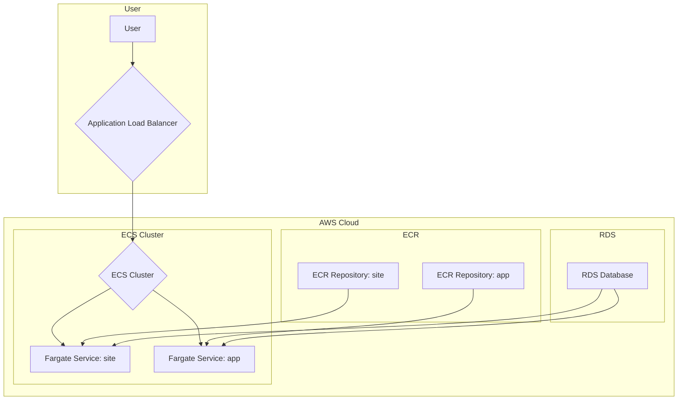

```mermaid
graph TD
    subgraph "User"
        A[User] --> B{Application Load Balancer}
    end

    subgraph "AWS Cloud"
        B --> C{ECS Cluster}

        subgraph "ECS Cluster"
            C --> D[Fargate Service: site]
            C --> E[Fargate Service: app]
        end

        subgraph "ECR"
            F[ECR Repository: site] --> D
            G[ECR Repository: app] --> E
        end

        subgraph "RDS"
            H[RDS Database] --> D
            H --> E
        end
    end
```
