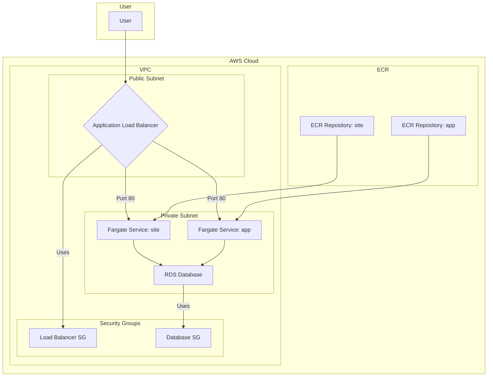

```mermaid
graph TD
    subgraph "User"
        A[User]
    end

    subgraph "AWS Cloud"
        subgraph "VPC"
            subgraph "Public Subnet"
                B{Application Load Balancer}
            end

            subgraph "Private Subnet"
                C[Fargate Service: site]
                D[Fargate Service: app]
                E[RDS Database]
            end

            subgraph "Security Groups"
                SG_LB[Load Balancer SG]
                SG_DB[Database SG]
            end
        end

        subgraph "ECR"
            F[ECR Repository: site]
            G[ECR Repository: app]
        end
    end

    A --> B
    B -- Port 80 --> C
    B -- Port 80 --> D

    C --> E
    D --> E

    F --> C
    G --> D

    B -- Uses --> SG_LB
    E -- Uses --> SG_DB
```